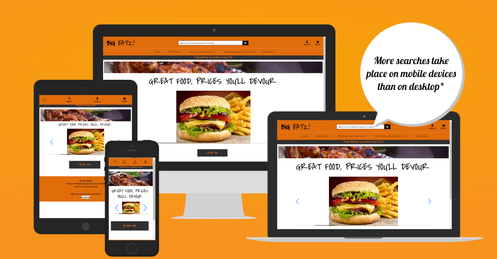
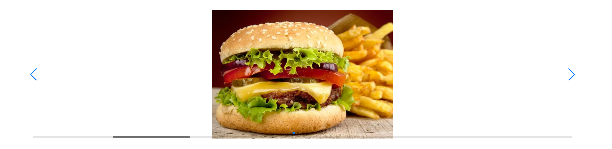
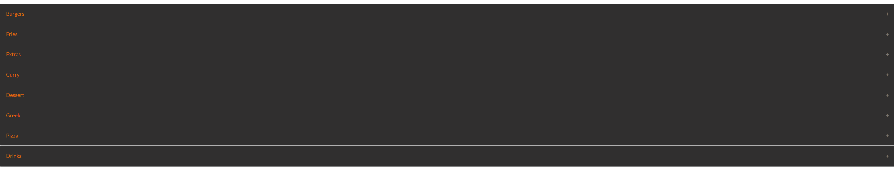
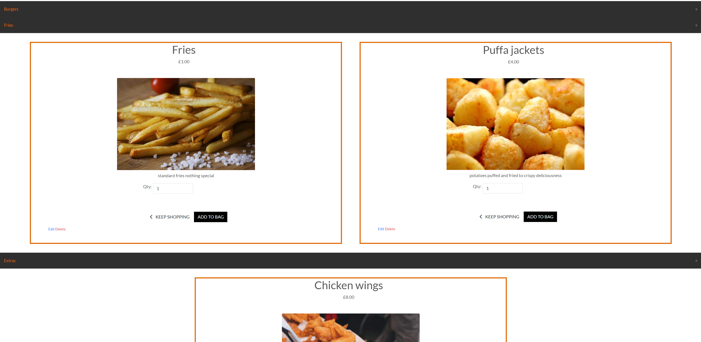
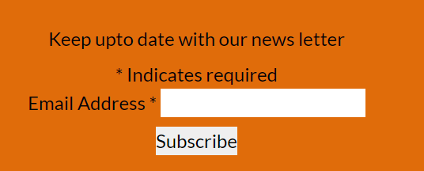
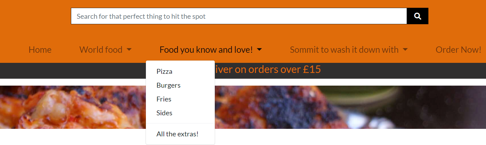
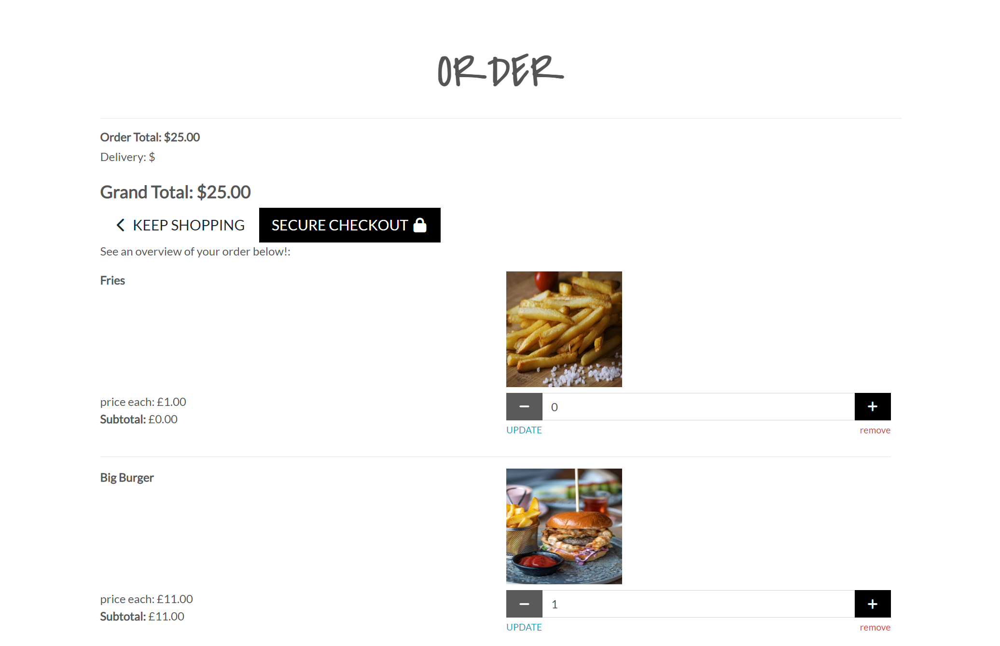
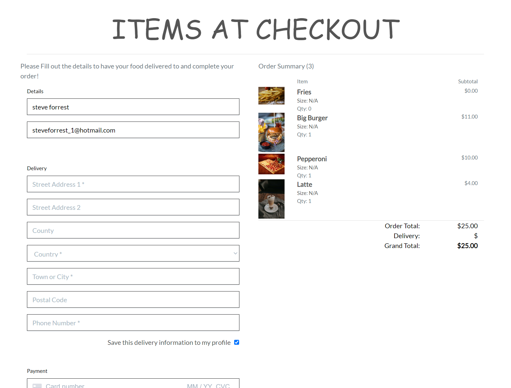

# Contents

* [Reasons for this project](#reasons-for-this-project)
* [UX/UI](#ux-ui) - screen shots, existing features explain and discribe the features
* [Bugs and solutions](#bugs-and-solutions)
* [User Stories](#user-stories)
* [Future builds](#future-builds) - - what youd like to add in the future
* [SEO](#seo) - Explain keywords
* [Deployment and clone](#deployment) - talk about enviroment variables
* [Lighthouse](#lighthouse) - screen shot before and after and talk about how u tried to resolve the issues
* [Wire frame](#wire-frame)
* [Languages](#languages)
* [Libraries and other technologies](#libraries-and-other-technologies)
* [Testing](#testing)
* [Citations](#citations)

# Reasons for this project

This site is designed to allow a restraunt advertise their food and allow them to place orders.
Customers will be able to sign up log in and log out, place order and view previous orders. 
Restraunt owners/ workers will be able to add new products and be able to look at whats sold.

# UX UI

## Am I Responsive

## Existing Features

### Swiper Carousel

Initially i useed a bootstrap carousel but there were several issue where the animation wasn't very fluid. Another big addition to using this was it is very good accessibility score.

### Navigational Buttons

I have buttons to allow linking to different pages

### Accordian closed

Accordian was created with HTML CSS and some bootstrap classes.

### Accordian open

### Mail chimp

Third part app embedded to enable news letters being sent out.

### Account and bag buttons

Account and bags are able to be accessed 

### Nav and Search bar

There is a nav bar and search bar in place to allow ease of navigation withn the site, products and categories can be searched.

### Order Summary

The summary of the order can be seen in toasts after successfully adding products and in the bag prior to going to the secure checkout.

### Checkout page

### Facebook page

# Bugs and solutions

* The reviews page was implemented last it has validation in the view to prevent lower than 0 and greater than 10.0 but this can be broken on the frnt end.
* The product card UI i would use grid in th e future to allow a consistant layout.
* When uploading images for some reason the file names are being channged in developement and therefore only work round is to reupload the images in the depoyed site
* allowing you to put the update below 0 on qty update / delete
* Add no image image
* product cards need the lay out sorting i would use grid to better arange this in furture
* Meta DATA ensure its in

# User Stories

* First time user
1. As a first time user I would like to be able to register to have an account 
2. As a first time user I would like to be able to view the menu
3. As a first time user I would like to be able to place an order

* Existing user
1. As an Existing customer I would like to be able to log in
2. As an Existing customer I would like to be able to log out
3. As an Existing customer I would like to be able to view the menu
4. As an Existing customer I would like to be able to place an order
5. As an Existing customer I would like to be able to see prvious order placed

* Site admin
1. As a site admin I would like to be able to Add products
2. As a site admin I would like to be able to edit products
3. As a site admin I would like to be able to delete products
4. As a site admin I would like to be able to view customer orders

# Future builds

1. The ability to add a rewards scheme so one the user has spent over a certain amount they will get a discount
2. I would add a many to many field to my products model and enable sub categories being utiulied for example being able to search for just pop or just milk shakes and get different types of milkshake.

# SEO

# Deployment

1. Ensure all the dependencies are included by adding them to the requirements.txt file by running the following command in the terminal: pip3 freeze > requirements.tx
2. Ensure the project has been fully committed and pushed to git 
3. Go to your heroku account, if you don't have one create one
4. On the home screen click on the create new app button
5. Enter a name for the project and select your region to the correct region.
6. On the next screen select settings
7. Go to config vars and click reveal config vars
8. Switch to the program file and where you are keeping your credentials copy these and then on heroku enter a name for the key and paste the code into the config vars value box and click add
9. Now scroll down to buildPacks and click add build packs
10. First select python and click save changes
11. Click back into build packs and choose node.js and click save again
12. Ensure that the Python  build pack is at the top of the list you are abe to drag and drop if you need to rearrange
13. Now select deploy
14. From the deployment method select GitHub
15. Then click on the connect to github button that appears
16. Click into the search box and search for the project name
16. Once located select connect
17. Then click deploy branch, this will then be shown in the box below
18. You can the click view to show the app in a browser

The program can be deployed automatically but i have chosen to keep it as a manual deploy so i can ensure that while i am testing and have no intention of adding more to the code currently it is better to deploy it manually meaning returning to the screen and clicking deploy branch each time you want to make any changes.

## Making a clone to run locally

* Log into GitHub.
* Select the repository.
* Click the Code dropdown button next to the green Gitpod button.
* Download ZIP file and unpackage locally and open with IDE. Alternatively copy the URL in the HTTPS box.
* Open the alternative editor and terminal window.
* Type 'git clone' and paste the copied URL.
* Press Enter. A local clone will be created.

# Lighthouse

# Wire frame

# Languages

* [Python](https://en.wikipedia.org/wiki/Python_(programming_language))
* [HTML5](https://en.wikipedia.org/wiki/HTML5)
* [CSS3](https://en.wikipedia.org/wiki/CSS)

# Libraries and other technologies

* [Django](https://www.djangoproject.com/)
* [Heroku](https://en.wikipedia.org/wiki/Heroku)
* [Font Awesome](https://fontawesome.com/)
* [GitHub](https://github.com/)
* [Cloudinary](https://cloudinary.com/)
* [Summer Note](https://summernote.org/)
* [Crispy forms](https://django-crispy-forms.readthedocs.io/en/latest/)
* [OAuth](https://oauth.net/)
swiper

# Testing

## Validation Testing

* [HTML testing](https://validator.w3.org/)

## Manual Testing

### The site has been tested by:- 

1. Basic testing
+ Users were able to register, log in and log out
+ Users were able to navigate the site in order to view different menu items, either through the order now buttons and the accordian or the serch functions.
+ Users were able to add menu items to the order and then place the order
+ Users were able to recieve a confirmation email for their order
+ User are able to go in and create a review of products - initially a float input field was going to be used but as i was getting a page error and i did not have the time to fully investigate this. I chose to use a drop down menu instead and this is working perfectly 
+ Admin users were able to add new products.
+ Admin users were able to edit and delete products.

### Responsiveness checked on the following devices
* 

## Automated test

Automated test have not been created due to time constraints. Light house has been used to 

### Automated have been written to check the following

# Citations
* Footer taken from [startbootstrap.com](https://startbootstrap.com/snippets/sticky-footer-flexbox)

# Functionality

* Toasts used to do varipois things such as :-
    + show successfully added product to bag 
    + info to detail how many search results there are
    + Error to let you know u have entered a quantity too high or low
