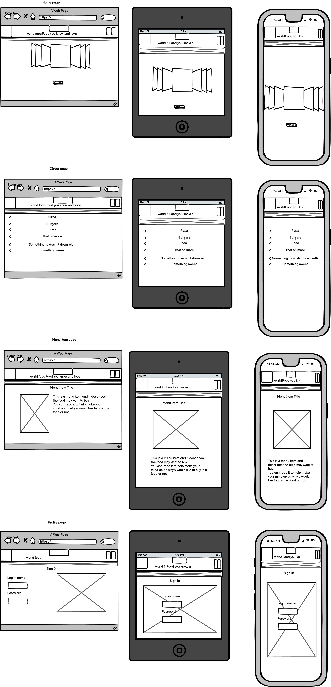

## Contents

* Reasons for this project
* UX
* User stories
* Future builds
* Deployment
* Wire frame
* Languages
* Libraries and other technologies
* Testing
* Things not working

## Reasons for this project

## UX

I have chose to use Ui because 

## User Stories

* First time user
1. As a first time user I would like to be able to register to have an account 
2. As a first time user I would like to be able to view the menu
3. As a first time user I would like to be able to place an order

* Existing user
1. As an Existing customer I would like to be able to log in
2. As an Existing customer I would like to be able to log out
3. As an Existing customer I would like to be able to view the menu
4. As an Existing customer I would like to be able to place an order
5. As an Existing customer I would like to be able to see prvious order placed

* Site admin
1. As a site admin I would like to be able to Add products
2. As a site admin I would like to be able to edit products
3. As a site admin I would like to be able to delete products
4. As a site admin I would like to be able to view customer orders

## Future builds

1. Adding the ability to amend quanitity from the order page
2. 

## Deployment

1. Ensure all the dependencies are included by adding them to the requirements.txt file by running the following command in the terminal: pip3 freeze > requirements.tx
2. Ensure the project has been fully committed and pushed to git 
3. Go to your heroku account, if you don't have one create one
4. On the home screen click on the create new app button
5. Enter a name for the project and select your region to the correct region.
6. On the next screen select settings
7. Go to config vars and click reveal config vars
8. Switch to the program file and where you are keeping your credentials copy these and then on heroku enter a name for the key and paste the code into the config vars value box and click add
9. Now scroll down to buildPacks and click add build packs
10. First select python and click save changes
11. Click back into build packs and choose node.js and click save again
12. Ensure that the Python  build pack is at the top of the list you are abe to drag and drop if you need to rearrange
13. Now select deploy
14. From the deployment method select GitHub
15. Then click on the connect to github button that appears
16. Click into the search box and search for the project name
16. Once located select connect
17. Then click deploy branch, this will then be shown in the box below
18. You can the click view to show the app in a browser

The program can be deployed automatically but i have chosen to keep it as a manual deploy so i can ensure that while i am testing and have no intention of adding more to the code currently it is better to deploy it manually meaning returning to the screen and clicking deploy branch each time you want to make any changes.

### Making a clone to run locally

* Log into GitHub.
* Select the repository.
* Click the Code dropdown button next to the green Gitpod button.
* Download ZIP file and unpackage locally and open with IDE. Alternatively copy the URL in the HTTPS box.
* Open the alternative editor and terminal window.
* Type 'git clone' and paste the copied URL.
* Press Enter. A local clone will be created.

## Wire frame

## Languages

* [Python](https://en.wikipedia.org/wiki/Python_(programming_language))
* [HTML5](https://en.wikipedia.org/wiki/HTML5)
* [CSS3](https://en.wikipedia.org/wiki/CSS)

## Libraries and other technologies

* [Django](https://www.djangoproject.com/)
* [Heroku](https://en.wikipedia.org/wiki/Heroku)
* [Font Awesome](https://fontawesome.com/)
* [GitHub](https://github.com/)
* [Cloudinary](https://cloudinary.com/)
* [Summer Note](https://summernote.org/)
* [Crispy forms](https://django-crispy-forms.readthedocs.io/en/latest/)
* [OAuth](https://oauth.net/)

## Testing

### Validation Testing

* [HTML testing](https://validator.w3.org/)

### Manual Testing

#### The site has been tested by:- 

#### Responsiveness checked on the following devices
* 

### Automated test

#### Automated have been written to check the following

## Things not working / known bugs

* When uploading images for some reason the file names are being channged in developement and therefore only work round is to reupload the images in the depoyed site
* allowing you to put the update below 0 on qty update / delete
* Add no image image
* product cards need the lay out sorting i would use grid to better arange this in furture

# Citations
* Footer taken from [startbootstrap.com](https://startbootstrap.com/snippets/sticky-footer-flexbox)