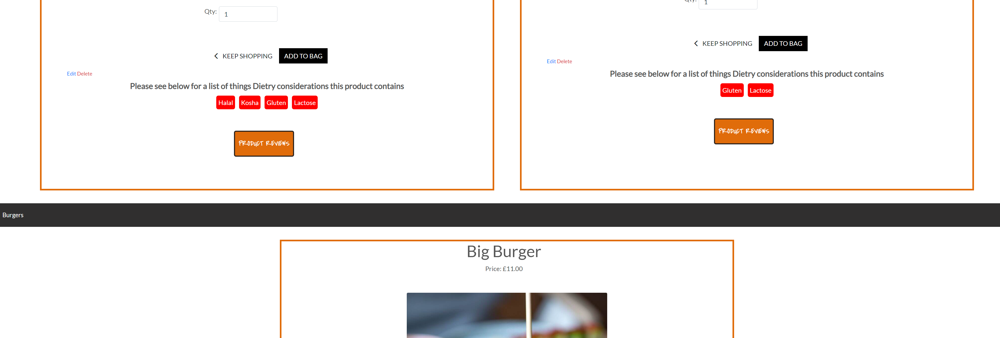
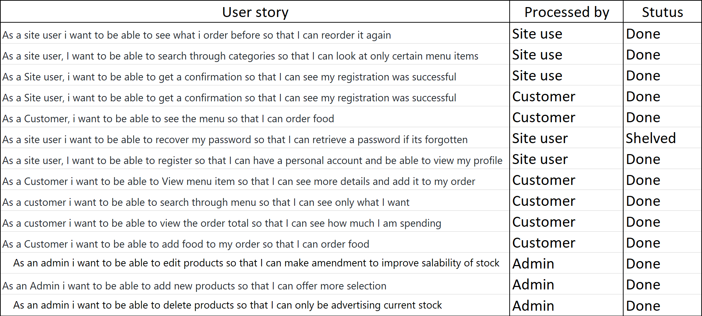
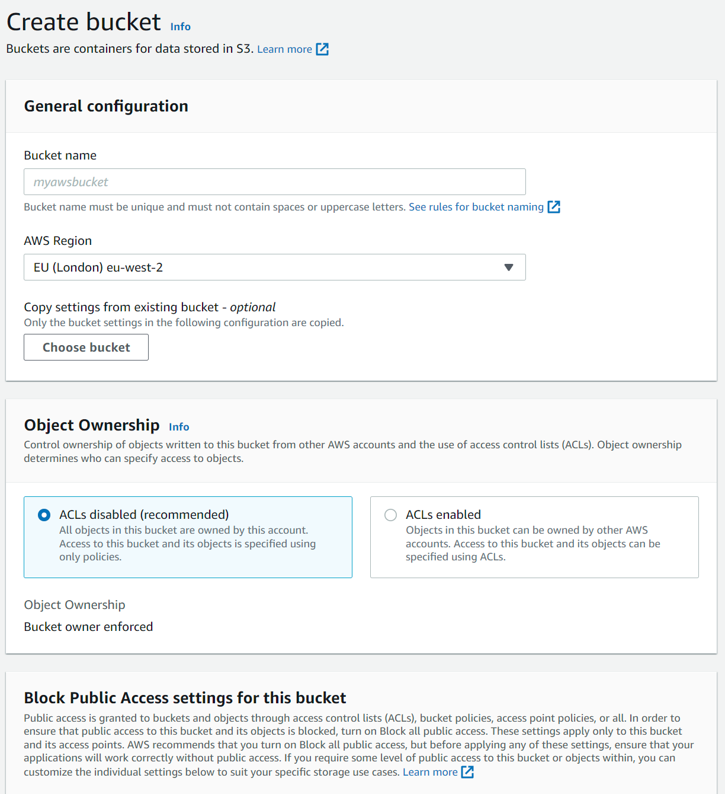
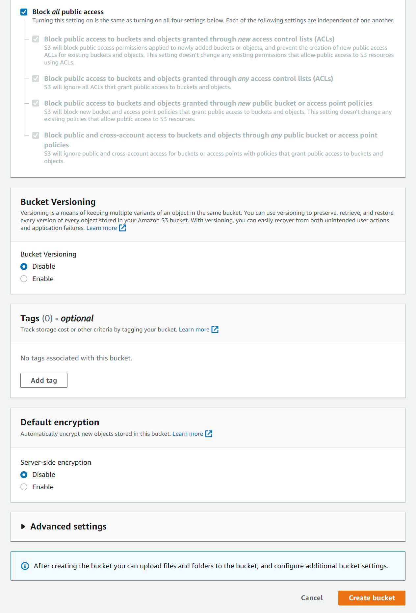
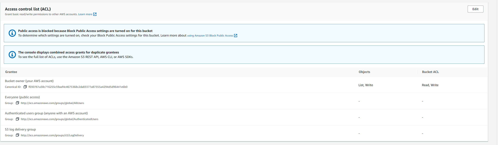
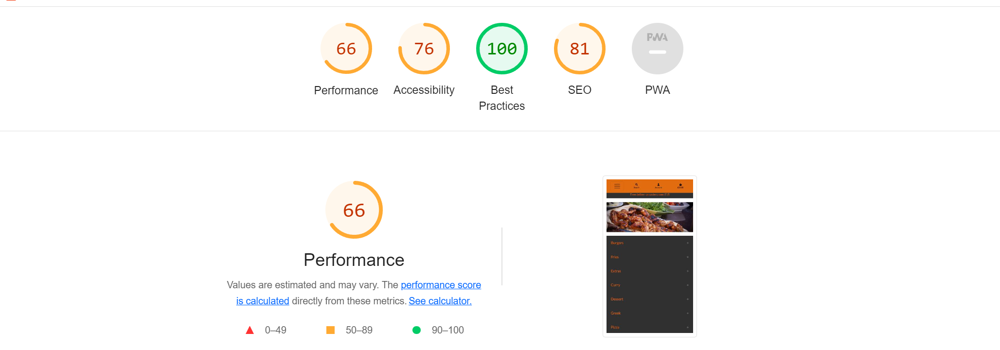
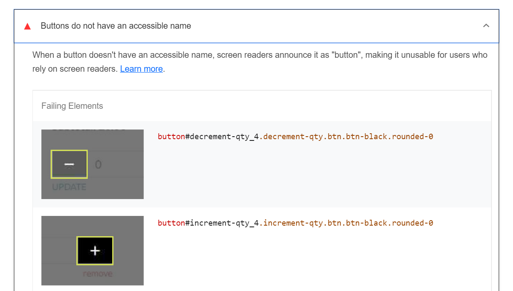
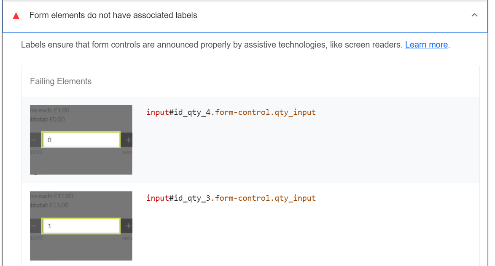
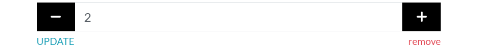
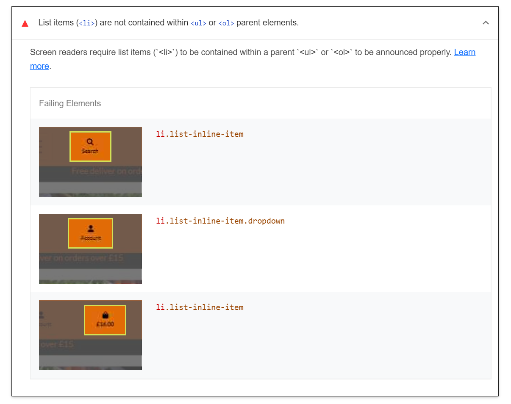

# Contents

* [Reasons for this project](#reasons-for-this-project)
* [UX/UI](#ux-ui)
* [Bugs and solutions](#bugs-and-solutions)
* [User Stories](#user-stories)
* [Future builds](#future-builds)
* [Deployment and clone](#deployment)
* [Lighthouse](#lighthouse)
* [Wire frame](#wire-frame)
* [Languages](#languages)
* [Libraries and other technologies](#libraries-and-other-technologies)
* [Testing](#testing)
* [Citations](#citations)

# Reasons for this project

This site is designed to allow a restraunt advertise their food and allow them to place orders.
Customers will be able to sign up log in and log out, place order and view previous orders. 
Restraunt owners/ workers will be able to add new products and be able to look at whats sold.

# UX UI

## Am I Responsive

## Existing Features

### Functionality

* Toasts used to do varipois things such as :-
    + show successfully added product to bag 
    + info to detail how many search results there are
    + Error to let you know u have entered a quantity too high or low
* Review used to allow customer to leave feed back and a rating on products
* Swiper carousel
* Accordian to allow users to better browse the menu

All features are shown below

### Swiper Carousel

Initially i useed a bootstrap carousel but there were several issue where the animation wasn't very fluid. Another big addition to using this was it is very good accessibility score.

### Navigational Buttons

I have buttons to allow linking to different pages

### Accordian closed

Accordian was created with HTML CSS and some bootstrap classes.

### Accordian open

### Mail chimp

Third part app embedded to enable news letters being sent out.

### Account and bag buttons

Account and bags are able to be accessed 

### Nav and Search bar

There is a nav bar and search bar in place to allow ease of navigation withn the site, products and categories can be searched.

### Order Summary

The summary of the order can be seen in toasts after successfully adding products and in the bag prior to going to the secure checkout.

### Checkout page

### Facebook page

# Bugs and solutions

* The reviews page was implemented last it has validation in the view to prevent lower than 0 and greater than 10.0 but this can be broken on the frnt end.
    * this was fixed using a work round using a dropdown menu instead of a text input.
* The product card UI i would use grid in th e future to allow a consistant layout.
* When uploading images for some reason the file names are being channged in developement and therefore only work round is to reupload the images in the depoyed site. This issue will happen as yet there is no known reason for this it maybe related to pushes but not confirmed as sometimes it works others it doesnt, it may also be an issue with the Postgres data base maybe there are multiple instances of the image in the db which is causing this. But the images may show fine byut for an unknown reason may not.
    * [RESOLVED] 
* product cards need the lay out sorting i would use grid to better arange this in furture
* 404 page is not working 
    * RESOLVED: DEBUG was not set to False
* User sign out button is unresponsive when clicked 
    + The button html was set outside of the form

# User Stories

* First time user
1. As a first time user I would like to be able to register to have an account 
2. As a first time user I would like to be able to view the menu
3. As a first time user I would like to be able to place an order

* Existing user
1. As an Existing customer I would like to be able to log in
2. As an Existing customer I would like to be able to log out
3. As an Existing customer I would like to be able to view the menu
4. As an Existing customer I would like to be able to place an order
5. As an Existing customer I would like to be able to see prvious order placed

* Site admin
1. As a site admin I would like to be able to Add products
2. As a site admin I would like to be able to edit products
3. As a site admin I would like to be able to delete products
4. As a site admin I would like to be able to view customer orders

# Future builds

1. The ability to add a rewards scheme so one the user has spent over a certain amount they will get a discount
2. I would add a many to many field to my products model and enable sub categories being utiulied for example being able to search for just pop or just milk shakes and get different types of milkshake.

# Deployment

1. Ensure all the dependencies are included by adding them to the requirements.txt file by running the following command in the terminal: pip3 freeze > requirements.tx
2. Ensure the project has been fully committed and pushed to git 
3. Go to your heroku account, if you don't have one create one
4. On the home screen click on the create new app button
5. Enter a name for the project and select your region to the correct region.
6. On the next screen select settings
7. Go to config vars and click reveal config vars
8. Switch to the program file and where you are keeping your credentials copy these and then on heroku enter a name for the key and paste the code into the config vars value box and click add
9. Now scroll down to buildPacks and click add build packs
10. First select python and click save changes
11. Click back into build packs and choose node.js and click save again
12. Ensure that the Python  build pack is at the top of the list you are abe to drag and drop if you need to rearrange
13. Now select deploy
14. From the deployment method select GitHub
15. Then click on the connect to github button that appears
16. Click into the search box and search for the project name
16. Once located select connect
17. Then click deploy branch, this will then be shown in the box below
18. You can the click view to show the app in a browser

The program can be deployed automatically but i have chosen to keep it as a manual deploy so i can ensure that while i am testing and have no intention of adding more to the code currently it is better to deploy it manually meaning returning to the screen and clicking deploy branch each time you want to make any changes.

## Making a clone to run locally

* Log into GitHub.
* Select the repository.
* Click the Code dropdown button next to the green Gitpod button.
* Download ZIP file and unpackage locally and open with IDE. Alternatively copy the URL in the HTTPS box.
* Open the alternative editor and terminal window.
* Type 'git clone' and paste the copied URL.
* Press Enter. A local clone will be created.

## Deploying to AWS 

### Bucket
* Go to [AWS](https://aws.amazon.com/) and create an AWS account
* sign in as an "iam user"
* Ensure payment details are entered
* in the search bar find S3
* create an S3 bucket
    * type in a memorable name for your bucket (suggestion: matche your project name)
    * set region to be yopur local region
    * 
    *  
* click into your bucket via its name 
* click the properties tab, at the bottom of this page click edit for Static website hosting click enablke and index.html for index and error for error.html
* On permission page:-
    * 
    * 
### IAM
* In the search bar search for IAM, click on the main title
* in the side menu click Users
* click create group
* name the group a rememberable and discriptive name
* click policies in the side menu - create policy, click import managed policy, search for AmazonS3FullAccess Copy ARN again and paste into "Resource" add list containint two elements "[ "arn::..", ""arn::../*]" First element is for bucket itself, second element is for all files and foldrs in the bucket
* Click bottom right Add Tags, than Click bottom right Next: Review Add name of the policy and add the description
* click create policy
* attach policy to the group 
    * go to user groups
    * select your group from the list
    * go to permissions tab and add the relevant permissions drop down and choose attach policies
* Create User to go in the group
    * User in the side menu and click add user
User name: your-app-staticfiles-user Check option: Access key - Programmatic access Click button at the bottom right for Next
    * Add user group and add user to the group you created earlier Click Next Tags and Next: review and Create user
    * Download .csv file
* Connect django to AWS S3 bucket
    * install the following - install boto3, install django-storages
    * update requirements.txt by freeze to requirements.txt
    * add storages to installed apps in settings.py
    * add heroku config vars
    
    *add customstorages.py file to the root directory
    
### upload the media to AWS
* go to the bucket, create a folder named media
* click upload select images to upload

# Wire frame

# Languages

* [Python](https://en.wikipedia.org/wiki/Python_(programming_language))
* [HTML5](https://en.wikipedia.org/wiki/HTML5)
* [CSS3](https://en.wikipedia.org/wiki/CSS)
* [JS](https://en.wikipedia.org/wiki/JavaScript)
* [JQuery](https://en.wikipedia.org/wiki/JQuery)
* [Django](https://www.djangoproject.com/)

# Libraries and other technologies

* [Django](https://www.djangoproject.com/)
* [Heroku](https://en.wikipedia.org/wiki/Heroku)
* [Font Awesome](https://fontawesome.com/)
* [GitHub](https://github.com/)
* [Summer Note](https://summernote.org/)
* [Crispy forms](https://django-crispy-forms.readthedocs.io/en/latest/)
* [OAuth](https://oauth.net/)
* [Swiper](https://swiperjs.com/)
* [Balsamiq](https://balsamiq.com/tutorials/articles/firstwireframe/)
* [Postgres](https://www.postgresql.org/)
* [AWS](https://aws.amazon.com/)

# Testing

## Validation Testing

### [HTML Validation](https://validator.w3.org/)
HTML vallidating was conducted using the above  site.
The HTML encountered several issue but these were down to django code being used, No HTML related error were encountered
* [Checkout app HTML validation folder](readmeDocs/validationFiles/HTML/checkout)
* [Home app HTML validation folder](readmeDocs/validationFiles/HTML/home)
* [Root folder HTML validation folder](readmeDocs/validationFiles/HTML/misc)
* [Order app HTML validation folder](readmeDocs/validationFiles/HTML/order)
* [Product app HTML validation folder](readmeDocs/validationFiles/HTML/product)
* [Profile app HTML validation folder](readmeDocs/validationFiles/HTML/profile)

### [CSS Validation](https://jigsaw.w3.org/css-validator/)

All validation passed.
[HTML validation folder](readmeDocs/validationFiles/CSS)

### [JS Validation](https://www.jslint.com/)
* Js Code in-
    * Checkout.html - Third party js from stripe
    * index.html - Third party js taken from Swiper
    * order.html - Jquery used to update and remove items from order keep it validated in the front end
    * profile.html - third party js used when choosing location country
    * static/js - Image can be seen in the below folder
    [View all JS validation](readmeDocs/validationFiles/JS)

### [Python validator](http://pep8online.com/) used is  pep8online.com
* [Checkout app python validation folder](readmeDocs/validationFiles/HTML/checkout)
* [Home app python validation folder](readmeDocs/validationFiles/HTML/home)
* [Root folder python validation folder](readmeDocs/validationFiles/HTML/misc)
* [Order app python validation folder](readmeDocs/validationFiles/HTML/order)
* [Product app python validation folder](readmeDocs/validationFiles/HTML/product)
* [Profile app python validation folder](readmeDocs/validationFiles/HTML/profile)

## Manual Testing

### The site has been tested by:- 

1. Manual testing
+ Users were able to register, log in and log out (bugged logging out)
+ Users were able to navigate the site in order to view different menu items, either through the order now buttons and the accordian or the serch functions.
+ Users were able to add menu items to the order and then place the order
+ Users were able to recieve a confirmation email for their order
+ User are able to go in and create a review of products - initially a float input field was going to be used but as i was getting a page error and i did not have the time to fully investigate this. I chose to use a drop down menu instead and this is working perfectly 
+ Admin users were able to add new products.
+ Admin users were able to edit and delete products.
+ as a user I was able to log in place items in the order from any page, leave a review, goto the basket amend qty update or remove and go to secure payment, i was able to have the payment go through and recieve the confirmation email aswell as the toast saying it was succcesfully processed

### Responsiveness checked on the following devices
* responsicveness was tested on 
    * windows desktop - 
        1. 

## Automated test

Automated test have not been created due to time constraints. Light house has been used to 

# Lighthouse

My initial testing has been very promising, there have been various issues including some in accessibilty although i believe these are mitigated during to the following reasons

These buttons have an icon within them an up chevron and a down chevron

These buttons do not have any text as they have font awesome icons and this seems to be confusing light house.

I am concious about my performance score only as this is the lowest one but i feel this is caused by the images i have i have tried to keep their sizes down using TinyPng but some times the images were unable to be reduced as much as id have liked.

# Citations
* Footer taken from [startbootstrap.com](https://startbootstrap.com/snippets/sticky-footer-flexbox)
* CI tutor support - special thanks to Ed, Alan and Osin
* Slack community - special shout out to Daisy mcg, Matt Bodden, Shane Muir, Anthony Obrien and Bim

